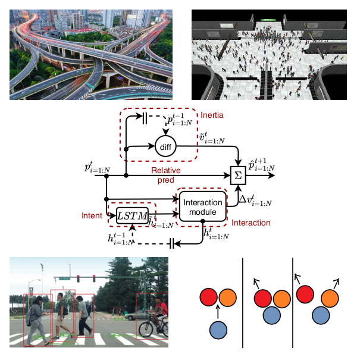

# Multi-agent Trajectory Prediction with Fuzzy Query Attention



This repository contains the official code for the paper:

**Multi-agent Trajectory Prediction with Fuzzy Query Attention**  
*Nitin Kamra, Hao Zhu, Dweep Trivedi, Ming Zhang and Yan Liu*  
Advances in Neural Information Processing Systems (NeurIPS), 2020

## Dependencies

The code has been written for `python3.5` and above. Apart from the `python3` standard libraries, the following other packages are required:
1. dill>=0.3.2
2. numpy>=1.19.2
3. torch>=1.4.0
4. matplotlib==3.0.0
5. pandas>=1.1.3
6. torch-scatter==1.4.0 (https://github.com/rusty1s/pytorch_scatter)

## Structure of the repository

The directory structure of the repository is as follows:

1. **config**: This directory contains the configuration files for the provided models. These config files contain important code settings and model hyperparameters and are needed as arguments to `src/run.py` script which trains and evaluates all models. The directory contains one base config file `cfg.py` which is extended by other model specific config files.
2. **data**: This folder contains the file `TrajectoryDataset.py` which provides the `TrajectoryDataset` class to convert and load all processed datasets in the required `torch` format. It also contains compressed and processed versions of all datasets used in the paper. We do not provide the raw datasets and the pre-processing scripts since the datasets are huge in size and the pre-processing scripts only add additional clutter to the repository. However, the raw datasets can be downloaded from their respective online sources if needed.
    1. While we provide our copy of `ETH-UCY`, `NGsim`, `Collisions` and `Charges`, we do not provide the `NBA` dataset since it requires special access and needs to be requested independently from the official sources if required.
    2. Each of our processed datasets contains three folders: `train`, `test` and `validation` with their respective scene files. Each scene file contains the trajectories of all agents in the format: `Time-step, AgentID, Normalized X-coord, Normalized Y-coord`.
    3. Each dataset also contains a file `scale.txt` which contains the normalization scale which is later used to de-normalize model predictions before calculating final evaluation metrics.
    4. Lastly each dataset contains a python file `<dataset>.py` which is used as an argument to the `src/run.py` script to load the dataset.
3. **models**: This folder contains some of the models used in the paper including our `FQA` architecture. From amongst the baselines, we only include `VanillaLSTM` and all the ablations of `FQA` (namely `InertiaModel` which comes in `models` directory and others which can be called by setting appropriate flags in `config/cfg_FQA.py` while training the FQA model). For the other baselines, we recommend contacting the original authors of the papers. Most of the common functionality and training procedure is provided in the abstract `BaseModel` class in the `models/BaseModel.py` file. All other models inherit the `BaseModel` class and add or override methods to provide additional functionality.
4. **src**: This folder contains all the runnable scripts:
    1. `run.py` is the major script which enables training and evaluation of all models.
    2. `generate_eval_metrics.py`: Once `run.py` has been called in both train and test modes on a dataset-model combination, this script de-normalizes the model's predictions on the dataset and produces final evaluation metrics.
    3. `viz.py` produces the joint visualization from all models on a specific dataset.
    4. `display_metrics.py`: This script collects scores from multiple training runs of all specified models on all specified datasets and aggregates them to produce mean, min, max and stdev for all scores.
    5. `exps.sh`: This shell script contains commands to easily reproduce most of the results presented in the paper. The commands exemplify the calling format for `run.py` along with providing all required hyperparameters to be specified for each model/dataset combination.
5. **utils**: This folder contains utility modules for plotting, model design, argument parsing etc.

## Running the code

0. Install all dependencies mentioned above.
1. Clone the repo and enter the main project directory:
```
git clone https://github.com/nitinkamra1992/FQA.git
cd FQA
```
2. Unzip all datasets in the `data` folder:
```
cd data
unzip charged.zip
unzip collisions.zip
unzip ethucy.zip
unzip ngsim.zip
cd ..
```
3. Open `src/exps.sh` and uncomment line 7 to set the value of run ID `i`. We set it to `1` by default but this can be set to any random integer since it controls the random seed for any run. The results in the paper have been produced by averaging over 5 runs with `i = {1,2,3,4,5}` for reproducibility. Note that this integer also controls the name of the output directory for most experiments to keep results from different runs from over-writing each other.
4. Now uncomment the remaining experiment lines one-by-one and run the `src/exps.sh` script with each of them to run all experiments one-by-one.
5. Note that within most sections of `src/exps.sh`, there are commented subsections of the form: `Train`, `Eval_test`, `Eval metrics`. For any model/dataset combination these three sub-sections must be run sequentially since they rely on the previous sub-section's results. But two different sections can be run independently in parallel. For instance, you can un-comment lines 49 and 57 simultaneously to launch two training experiments in parallel: one to train `VanillaLSTM` on `Collisions` data and another to train it on `ETH-UCY` data.
6. You can run multiple experiments in parallel as long as your GPU memory permits. You can also run multiple experiments in parallel on different GPU devices (or CPU) by specifying the device in the arguments to `src/run.py` with `--device` argument.